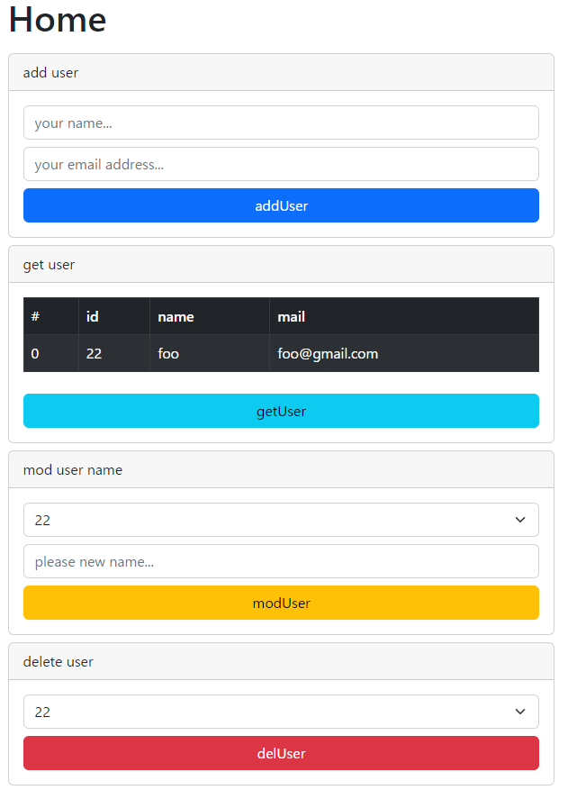

# スキルチェック

---
## 0.言語とフレームワーク
- フレームワーク => (Flask,React)
- 言語 => (Python,JavaScript,TypeScript)

バックエンドはFlaskでアプリケーションを作成する。<br>
フロントエンドはReactでアプリケーションを作成する。<br>

---
## 1.WEBアプリケーション作成
- Reactでフロントエンドアプリケーションを開発できる
- HTTP通信でデータを更新・取得できる

リポジトリ内にあるReactのプロジェクトフォルダ(ui)に[デモページ](http://52.199.224.236:5001/)のようなコンポーネントを作成する。<br>
レイアウトは最低限整っていればよしとする。<br>
以下の機能を実装する。<br>
1. デザインは[Bootstrap](https://react-bootstrap.github.io/)を使用する
2. HTTP通信は[axios](https://www.npmjs.com/package/axios)を使用する
3. ユーザー名＋メールアドレスを入力して"addUser"ボタンでDBに登録する
4. DBのusersテーブルの全てのレコードを"getUser"ボタンで取得してテーブルに表示する
5. 対象のIDを選択＋新しい名前を入力して"modUser"ボタンでDBに登録されている名前を変更する
6. 対象のIDを選択して"delUser"ボタンでDBに登録されているレコードを削除する
7. レスポンスのステータスコードに応じてアラートを表示する
8. POSTしたい内容はクエリパラメータまたはBodyにJSONで記述の好きなほうでよい



---
## 2.REST APIの作成
- APIのエンドポイント(URI)を設計できる
- GET,POST,DELETEなどのリクエストに対して適切な処理を行うことができる

APIは[Flask](https://flask.palletsprojects.com/en/2.2.x/)を使用して作成する。<br>
ファイルは分割しても良いがメイン処理(GET,POST,DELETE)はリポジトリ内の"app.py"に記述する。<br>
以下にURIの例を示す。<br>
ユーザー情報の取得 => GET:http://127.0.0.1/v1/users?id=all<br>
ユーザー情報の追加 => POST:http://127.0.0.1/v1/users?type=add<br>
ユーザー情報の変更 => POST:http://127.0.0.1/v1/users?type=mod<br>
ユーザー情報の削除 => POST:http://127.0.0.1/v1/users?type=del<br>

# sample-02.png

---
## 3.DBの操作
- DBに対してORMでCRUD処理(Create,Read,Update,Delete)を実行できる

ORMは[SQLAlchemy](https://www.sqlalchemy.org/)を使用する。<br>
SQLAlchemyを使用するならDBの種類は問わない。<br>
以下にテーブル作成SQL(PostgreSQL)の例を示す。<br>
```
CREATE TABLE IF NOT EXISTS public.users
(
    id integer NOT NULL DEFAULT nextval('users_id_seq'::regclass),
    name character varying(128) COLLATE pg_catalog."default" NOT NULL,
    mail character varying(128) COLLATE pg_catalog."default" NOT NULL,
    CONSTRAINT users_pkey PRIMARY KEY (id),
    CONSTRAINT users_mail_key UNIQUE (mail)
)
```

# sample-03.png

---
## 4.WEBサーバの構築
- サーバに作成したアプリケーションをデプロイし、サービスを開始できる

AWSやHerokuなどのレンタルサーバを使ってアプリケーションを公開する。<br>
以下にアーキテクチャ(AWS)の例を示す。<br>

# sample-04.png

---
## 5.提出物
- zipで圧縮したローカルリポジトリ
- 公開したアプリケーションのURL